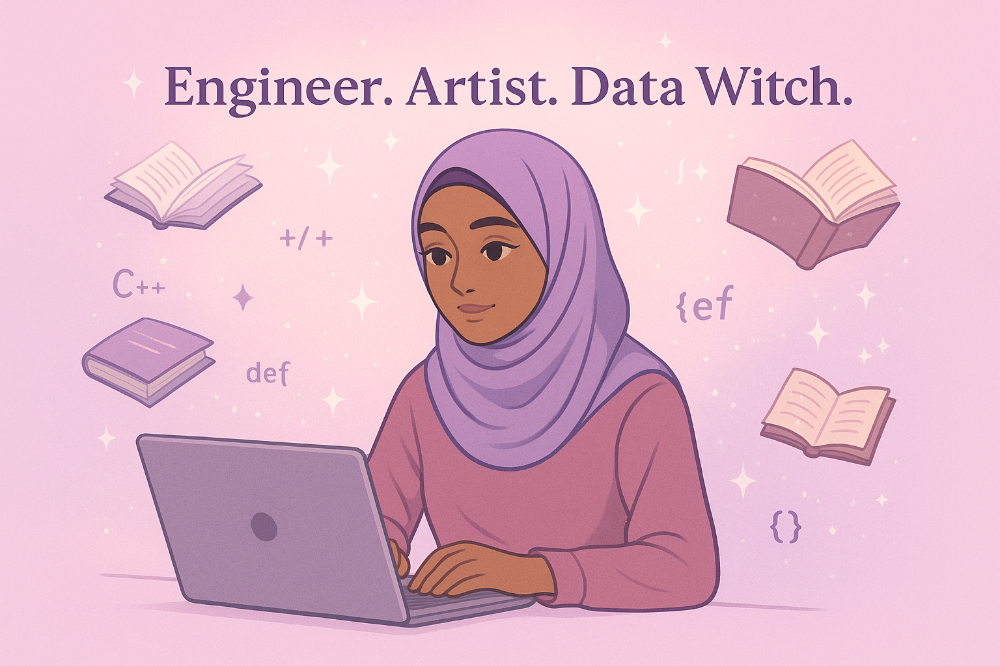

<!-- Banner -->

  

# 👋 Hi there, I'm Asiyah Speight!

I'm a Data Science undergraduate at Chapman University with a growing passion for automation, control systems, and the intersection of data, engineering, and geography. I enjoy exploring how technology can be applied across fields to make meaningful impact—especially through cross-disciplinary work.

---

## 👁️‍🗨️ I'm interested in:
- Data science & machine learning for social good 🌍  
- Ethical tech, AI fairness, and algorithmic bias ⚖️  
- Interactive data visualizations 📊  
- Human-computer interaction and user research 🧠  
- Manufacturing and fabrication 🏭  
- Electrical engineering ⚡  
- Mechanical engineering 🔧  

---

## 🌱 I'm currently learning:
- Advanced C++ and algorithms (retaking with a vengeance 💪)  
- Network protocols and socket programming (CPSC 353)  
- Tableau, Alteryx, and applied analytics (MGSC 410)  
- Arabic grammar and root system linguistics  

---

## 💖 I'm looking to collaborate on:
- Open-source data projects that make a difference  
- Visual storytelling using data  
- Beginner-friendly repositories with mentorship opportunities  

---

## 📫 How to reach me:
- 📧 Email: [aspeight@chapman.edu](mailto:aspeight@chapman.edu)  
- 💼 LinkedIn: [linkedin.com/in/asiyahspeight](https://www.linkedin.com/in/asiyahspeight)  
- 🌐 Portfolio: *Coming soon!*  

---

## 😄 Pronouns:
She/Her  

---

## ⚡ Fun facts:
- I love manga and fantasy novels 📚  
- I enjoy modest fashion and expressing creativity through style 🧕🏾  
- I’m deeply committed to creating space for others who feel like outsiders in tech—you *do* belong here!

---

## 🛠️ Tools & Languages

---

## 📊 GitHub Stats

---

> 💻 *Currently hacking my way through C++, Arabic grammar, and life.*  
> ✨ *Bringing heart to hard code.*

<!---
AsiyahSpeight/AsiyahSpeight is a ✨ special ✨ repository because its `README.md` (this file) appears on your GitHub profile.
You can click the Preview link to take a look at your changes.
--->

